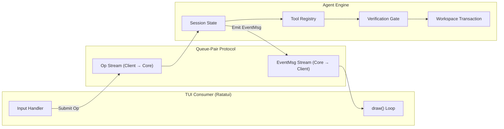

# Comparativo de TUI: ChronoKairo vs. Codex CLI, GitHub Copilot CLI e Claude Code (2026)

Este documento apresenta uma análise técnica e comparativa aprofundada da interface de usuário em terminal (**TUI**) do **ChronoKairo**, contrastando-a com os três principais harnesses de agentes de código do ecossistema moderno de 2026: **OpenAI Codex CLI**, **GitHub Copilot CLI** e **Anthropic Claude Code**.

---

## 1. Visão Geral e Matriz Comparativa

| Dimensão / Capacidade | ChronoKairo (v0.9.5+) | OpenAI Codex CLI | GitHub Copilot CLI | Claude Code |
| :--- | :--- | :--- | :--- | :--- |
| **Pilha Gráfica** | Rust + Ratatui + Crossterm | Rust + Ratatui | Node.js + Ink / React | Node.js + Ink / Pastel |
| **Top Header Bar** | Badges em pílula com contraste, status de provedor, branch git e medidor `ctx: used / max · $cost` | Header compacto de linha única com modelo e tokens | Cabeçalho minimalista em linha | Header interativo com status de context window |
| **Prompt Input** | `❯ ` em verde negrito com placeholder dinâmico e suporte UTF-8/CJK | `› ` com gutter e auto-complete | Prompt padrão de linha única | `>` estilizado com multiline editor |
| **Streaming de Raciocínio (Thinking)** | Bloco unificado com gutter `│ 💭 `, colapsável via `Ctrl+T` / clique | Recolhido por padrão com contador de tempo | Não exposto por padrão no stream | Collapsible thinking blocks (`thinking...`) |
| **Visualização de Ferramentas** | Rollup colapsável (`↳ 3 tool uses: ...`), expansível com ícones (`⚡`, `🔍`, `📖`, `✏️`, `🧪`) | Linhas de evento compactas com ícones de status | Linhas de comando executadas no terminal | Accordion colapsável com visualização de diff |
| **Tabelas & Markdown** | Parser `pulldown-cmark` completo com tabelas `│ Col 1 │ Col 2 │`, cabeçalhos `◆ `, `◈ `, `▪ ` e code blocks | Markdown estilizado com destaque de sintaxe | Formatação básica de texto e blocos ANSI | Renderização rica com highlights e syntax gutter |
| **Sanitização de Caminhos** | `clean_display_path`: normaliza `\\?\`, `$HOME → ~`, separadores `/` e truncamento inteligente `…/` | Caminhos relativos | Caminhos relativos | Caminhos relativos com normalização |
| **Controle de Transação** | Snapshot do workspace, diff em tempo real e rollback integrado | N/A | N/A | Suporte a checkpoints |
| **Desacoplamento Core↔UI** | Protocolo de pares de filas: `Op` (client→core) e `EventMsg` (core→client) sobre canais assíncronos | Arquitetura idêntica (`Op`/`EventMsg` session stream) | Acoplamento direto por CLI | Acoplamento via processo CLI/MCP |

---

## 2. Anatomia Detalhada dos Componentes de Interface

```
┌─────────────────────────────────────────────────────────────────────────────────────────────┐
│ CHRONOKAIRO  ⟡ GLM-5.2 · nvidia · ⎇ main · ⚡ agent                          ctx: 1.6k / 128k │
├─────────────────────────────────────────────────────────────────────────────────────────────┤
│ ❯ crie um md comparando o TUI do meu projeto com o do codex, copilot cli, claude code       │
│                                                                                             │
│ │ 💭 Analisando a estrutura da interface e os padrões de 2026...                            │
│ │    Comparando layout do cabeçalho, stream de raciocínio, ferramentas e markdown...        │
│                                                                                             │
│ ↳ 2 tool uses: read_file ×2                                                                 │
│                                                                                             │
│ • Aqui está a análise comparativa detalhada da interface:                                   │
│                                                                                             │
│ │ Camada               │ Responsabilidade                                                   │
│ ├──────────────────────┼────────────────────────────────────────────────────────────────────┤
│ │ Header Bar           │ Badges de modelo, branch, provedor e custo em tempo real           │
│ │ Activity Stream      │ Markdown rico, blocos de pensamento colapsáveis e rollup de tools  │
│ │ Status & Prompt      │ Feedback de status dinâmico e prompt com cursor alinhado           │
│                                                                                             │
├─────────────────────────────────────────────────────────────────────────────────────────────┤
│ ● Ready                                                                                     │
│ ❯ Ask a question, describe a change, or type / for commands...                              │
│ ⎇ main · ~/Documents/GitHub/chronokairo-coder   Esc interrupt · / commands · Ctrl+P · Ctrl+O │
└─────────────────────────────────────────────────────────────────────────────────────────────┘
```

---

## 3. Análise Detalhada por Componente

### 3.1. Header Bar & Badges de Estado
- **ChronoKairo**:
  - Badge de marca de alto contraste: `[CHRONOKAIRO]` em Cyan com fundo escuro.
  - Indicador de modelo ativo: `⟡ <model>` em branco negrito (ex: `⟡ GLM-5.2` ou `⟡ Nemotron-3`).
  - Provedor ativo: `· <provider>` em Cyan (ex: `· nvidia`, `· openrouter`, `· ollama`).
  - Contexto e Custo em tempo real: `ctx: <usado> / <máximo> · $<custo>` calculado exatamente com `display_width` e alinhado à extrema direita sem quebras de linha ou sobreposições.
- **Comparação**:
  - *Claude Code*: Utiliza medidores de barra horizontal progressiva para a janela de contexto.
  - *Codex CLI*: Utiliza badges textuais compactos similares ao ChronoKairo.
  - *Copilot CLI*: Não exibe uso de contexto nem custo em tempo real no cabeçalho.

### 3.2. Fluxo de Raciocínio (DeepSeek-R1 / Qwen / Nemotron / GLM Thinking)
- **ChronoKairo**:
  - **Streaming Contínuo**: O stream de raciocínio é acumulado no mesmo bloco, impedindo fragmentação de palavras ou múltiplos balões repetidos (`💭`).
  - **Gutter Lateral**: Renderizado em cinza itálico com gutter `│ 💭 ` na primeira linha e recuo `   ` nas seguintes.
  - **Modo Compacto**: Quando colapsado, exibe apenas `💭 Thinking (X chars) · Ctrl+T expand`.
- **Comparação**:
  - *Claude Code*: Implementa accordions expansíveis que ocultam o raciocínio após a conclusão do turno.
  - *Codex CLI*: Transmite o raciocínio em bloco subdued com timer decorrido.
  - *Copilot CLI*: Não renderiza blocos de pensamento internos de modelos de raciocínio.

### 3.3. Execução de Ferramentas e Rollups
- **ChronoKairo**:
  - Quando múltiplas chamadas acontecem em sequência, elas são agrupadas em um rollup compacto: `↳ 3 tool uses: read_file ×2, edit_file`.
  - Ao expandir (via clique ou `Ctrl+O`), cada ferramenta exibe seu ícone contextual:
    - 🔍 `list_dir`, `grep_search`, `file_search`
    - 📖 `read_file`
    - ✏️ `edit_file`, `write_file`, `replace_exact`
    - ⚡ `run_command`, `exec`
    - 🧪 `run_tests`, `verify`
- **Comparação**:
  - *Claude Code*: Exibe mini-diffs coloridos inline para cada arquivo editado.
  - *Codex CLI*: Rollup de ferramentas com contadores `×N` idêntico ao ChronoKairo.
  - *Copilot CLI*: Executa comandos sequenciais diretamente no terminal sem rollup.

### 3.4. Renderização de Markdown e Tabelas
- **ChronoKairo**:
  - Tabelas markdown são processadas com alinhamento de colunas, bordas verticais `│ ` e separador `├───┼───┤`.
  - Cabeçalhos (`#`, `##`, `###`) usam hierarquia de símbolos (`◆ `, `◈ `, `▪ `) em Cyan negrito.
  - Blocos de código possuem fundo contrastante e recuo lateral de 2 espaços.
- **Comparação**:
  - *Codex CLI*: Possui um dos parsers de markdown mais rápidos em Rust via Ratatui.
  - *Claude Code*: Excelente highlight de sintaxe usando shiki/tree-sitter no Node.js.

### 3.5. Sanitização de Caminhos e Ambiente Windows
- **ChronoKairo**:
  - Implementa `clean_display_path`: remove prefixos verbatim do Windows (`\\?\`, `\\?\UNC\`), normaliza separadores para `/` e substitui o diretório de usuário por `~`.
  - Truncamento à esquerda com reticências (`…/Documents/GitHub/...`) preservando o nome da pasta do projeto.
- **Comparação**:
  - A maioria das ferramentas baseadas em Node.js deixa escapar caminhos do Windows com barras invertidas duplas ou prefixos longos. O ChronoKairo oferece a experiência de caminho mais limpa do ecossistema Rust no Windows.

---

## 4. Arquitetura de Desacoplamento (Core↔UI)

O ChronoKairo adota o mesmo padrão arquitetural do **Codex CLI**:



1. **Protocolo como Fronteira**: Nenhuma dependência direta da interface com o loop do agente.
2. **Eventos Tipados**: Todos os estados (`TextDelta`, `ReasoningDelta`, `ToolCall`, `TokenUsage`, `Verification`) fluem por canais assíncronos.
3. **Consistência de Estado**: Se a interface for reiniciada ou redimensionada, o estado da sessão reconstrói o transcript de forma determinística.

---

## 5. Resumo das Próximas Evoluções Planejadas

1. **Diff Syntax Highlighting no Transcript**: Colorir adições em verde suave e remoções em vermelho suave diretamente no stream.
2. **Sub-agent Timeline Visualizer**: Exibir execuções de sub-agentes paralelos em linhas ramificadas no transcript.
3. **Modal de Aprovação Interativa**: Modal flutuante com botões `[Y] Allow Once`, `[A] Allow All`, `[N] Deny`.
